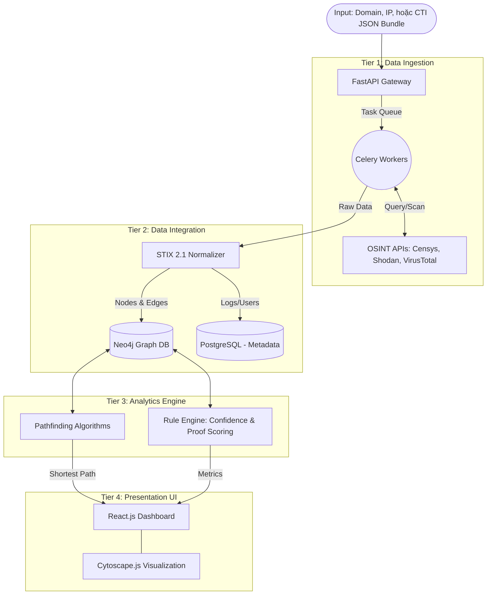

# An Automated Threat Intelligence Framework for Link Analysis and Infrastructure Attribution in Cyber Fraud Investigation
Tên đề tài: Nghiên cứu, xây dựng hệ thống tự động hóa thu thập tình báo và phân tích liên kết hỗ trợ định vị hạ tầng lừa đảo trực tuyến.

# Bản Đề xuất Đồ án Tốt nghiệp / Graduation Project Proposal

## Tổng quan đề tài (Project Overview)

### Đặt vấn đề (Motivation)
Tình trạng lừa đảo trực tuyến (Cyber Fraud/Scam) nhắm vào người dùng Việt Nam đang diễn biến cực kỳ phức tạp với quy mô công nghiệp (các trang web cá cược giả mạo, sàn đầu tư ảo, phishing). Để che giấu danh tính, tội phạm mạng thường nâng cao tính ẩn danh hạ tầng (OPSEC) thông qua các dịch vụ Reverse Proxy, CDN, VPN và Bulletproof Hosting. 

Tuy nhiên, do quy trình vận hành vội vàng hoặc quản lý số lượng lớn, kẻ tấn công thường để lại các lỗi cấu hình như: lộ subdomain chưa proxy, rò rỉ IP từ Mail server, cấu hình SSL/TLS Certificate chung, hoặc các dịch vụ phụ (API/Staging) lỏng lẻo. 

Dự án này tập trung xây dựng một hệ thống tự động hóa có khả năng cào dữ liệu trên diện rộng, chuẩn hóa và phân tích liên kết giữa các thực thể mạng để tìm ra sơ hở OPSEC của đối tượng, giảm thiểu thời gian điều tra thủ công.

### Mục tiêu (Objectives)
*   **Nghiên cứu lý thuyết:** Làm rõ các kỹ thuật ẩn danh hạ tầng và các phương pháp "bóc vỏ", phát hiện dấu vết từ tầng mạng (DNS History, Certificate/SAN) đến tầng ứng dụng (Mail Header, API Outbound Traffic).
*   **Mô hình toán học:** Thiết lập hệ thống luật tự động đánh giá mức độ tin cậy (`Confidence Score`) và bằng chứng xác thực (`Proof Score`) của từng manh mối (Lead), giảm tỷ lệ Dương tính giả (False Positive).
*   **Sản phẩm kỹ thuật:** Phát triển một nền tảng tự động chạy Playbook điều tra khi nhận vào một Indicator ban đầu, trực quan hóa mạng lưới hạ tầng dưới dạng Đồ thị.

---

## Kiến trúc hệ thống dự kiến (System Architecture)

Hệ thống được thiết kế theo kiến trúc 4 tầng phân tách rõ ràng (4-Tier Architecture):

1.  **Data Ingestion Tier (Python Scrapers):** Sử dụng Python + Celery thực hiện truy vấn không đồng bộ đến các cổng API (Censys, Shodan, VirusTotal, Passive DNS) và chủ động quét các cổng mở.
2.  **Data Integration Tier (STIX 2.1 & Neo4j):** Chuẩn hóa toàn bộ thực thể thu thập được về định dạng Tình báo mối đe dọa quốc tế **STIX 2.1**. Dữ liệu được lưu trữ và biểu diễn trên Cơ sở dữ liệu đồ thị (**Graph Database - Neo4j**).
3.  **Analytics Tier (Rule Engine):** Áp dụng các thuật toán đồ thị (như Shortest Path) để tìm ra tuyến đường ngắn nhất từ IP Proxy bề nổi đến Origin IP tiềm năng.
4.  **Presentation Tier (React.js & Cytoscape.js):** Dashboard trực quan hiển thị "Cây truy vết", các nút (Nodes), các cạnh (Edges) thể hiện mối quan hệ và tiến độ điều tra.

---

## Công nghệ sử dụng (Tech Stack)

*   **Backend:** Python, FastAPI, Celery
*   **Frontend:** React.js, TailwindCSS, Cytoscape.js / D3.js
*   **Database:** Neo4j (Graph Database), PostgreSQL (Metadata)
*   **Standards:** STIX 2.1 (Structured Threat Information Expression)
*   **DevOps:** Linux (Debian/Kali), Docker, Docker Compose

---

## Kế hoạch Demo dự kiến (Demo Plan)

*   **Môi trường triển khai:** Hệ thống được đóng gói hoàn toàn bằng Docker & Docker Compose, cho phép khởi tạo toàn bộ các dịch vụ (Backend, Frontend, Neo4j, Workers) chỉ bằng một lệnh `docker-compose up -d`.

**Kịch bản thực hiện (Truy vết mạng lưới lừa đảo tĩnh):**

*   **Bước 1 - Khởi tạo (Input):** Người dùng (Điều tra viên) tải lên hệ thống một tệp hồ sơ truy vết `CTI Bundle (JSON)` hoặc nhập trực tiếp một domain lừa đảo (ví dụ: `win880.cyou`).
*   **Bước 2 - Tự động thu thập (Ingestion & Normalization):** Hệ thống kích hoạt các Celery Workers để bóc tách tệp JSON, đồng thời quét bổ sung các chứng chỉ TLS/SSL, lịch sử DNS và cấu hình hạ tầng hiện tại. Toàn bộ dữ liệu thô được chuẩn hóa thành các thực thể STIX 2.1.
*   **Bước 3 - Trực quan hóa (Graph Visualization):** Giao diện React.js ngay lập tức render ra "Cây truy vết" mạng lưới hạ tầng của mục tiêu. Người dùng có thể zoom, kéo thả và quan sát các cụm (clusters) server dùng chung chứng chỉ hoặc chung mã theo dõi.
*   **Bước 4 - Phân tích & Gợi ý (Attribution & Playbook):** 
    * Thuật toán chấm điểm của hệ thống tính toán và làm nổi bật các "Manh mối yếu" (Ví dụ: IP trỏ về Cloudflare San Francisco mang điểm Proof 0/100, Hint vị trí Việt Nam/Campuchia mang điểm Confidence 49/100).
    * Hệ thống tự động vạch ra "Đường tối ưu", chỉ ra điểm nghẽn hiện tại (kẹt ở lớp proxy) và đề xuất người dùng sử dụng các Connector nội bộ có thẩm quyền để giải ẩn danh nút thắt này.

## Tài liệu tham khảo (References)
### Tiêu chuẩn CTI và Mô hình hóa Dữ liệu
1. OASIS Open. STIX Version 2.1 - OASIS Open. https://www.oasis-open.org/standard/stix-version-2-1/
2. Tools and Standards for Cyber Threat Intelligence Projects. (2026). SANS Institute. https://www.sans.org/white-papers/34375
3. Mavroeidis, V., & Bromander, S. (2017, September 1). Cyber Threat Intelligence Model: An Evaluation of Taxonomies, Sharing Standards, and Ontologies within Cyber Threat Intelligence. IEEE Xplore. https://doi.org/10.1109/EISIC.2017.20

### Cơ sở dữ liệu đồ thị & Phân tích liên kết
4. Noel, S., Harley, E., Tam, K. H., Limiero, M., & Share, M. (2016). CyGraph: Graph-Based Analytics and Visualization for Cybersecurity. In Handbook of Statistics (Vol. 35, pp. 117–167). Elsevier. https://doi.org/10.1016/bs.host.2016.07.001
5. Neo4j. Graph databases for fraud detection & analytics | Neo4j. Graph Database & Analytics. https://neo4j.com/use-cases/fraud-detection/
6. Mavroeidis, V., & Bromander, S. (2017). Cyber Threat Intelligence Model: An Evaluation of Taxonomies, Sharing Standards, and Ontologies within Cyber Threat Intelligence. 2017 European Intelligence and Security Informatics Conference (EISIC), 91–98. https://doi.org/10.1109/eisic.2017.20

### Kỹ thuật OSINT & Bóc tách hạ tầng
7. Bazzell, M. (2021). Open source intelligence techniques : Resources for searching and analyzing online information. Inteltechniques.Com.
8. Durumeric, Z., Adrian, D., Mirian, A., Bailey, M., & Halderman, J. A. (2015). A Search Engine Backed by Internet-Wide Scanning. Proceedings of the 22Nd ACM SIGSAC Conference on Computer and Communications Security. https://doi.org/10.1145/2810103.2813703
9. Vissers, T., Van Goethem, T., Joosen, W., & Nikiforakis, N. (2015). Maneuvering Around Clouds. Bypassing Cloud-based Security Providers, 1530–1541. https://doi.org/10.1145/2810103.2813633

### Báo cáo thực trạng lừa dảo & Khác
10. Group-IB. (2026, May 13). Digital Risk Highlights 2025: Scams Don’t Respect Borders | Group-IB. https://www.group-ib.com/resources/research-hub/digital-risk-highlights-2025/
11. Cục An toàn thông tin (AIS) - Bộ TT&TT. "Handbook Kỹ năng nhận diện & phòng chống lừa đảo trực tuyến". https://mic.mediacdn.vn/639352410187198464/2024/10/12/handbook-ky-nang-nhan-dien-va-phong-chong-ldtt-17287203507741788084357.pdf
